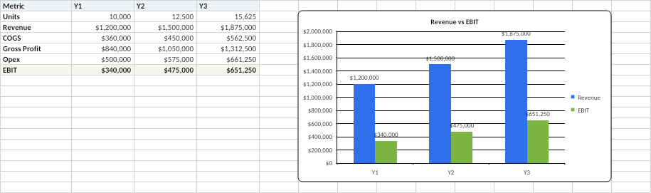

# Witan XLSX Agent

Spreadsheet support for Deep Agents via the
[Witan Headless Excel CLI](https://www.witanlabs.com/) — read,
write, calculate, render, and lint Excel workbooks.

This example adds the support through a project-local skill. It does not
require any custom middleware or SDK wrappers.

## How It Works

The interface is **code mode**: the agent writes a short JavaScript against a
`wb` handle and gets the result back, instead of making N discrete tool calls.
See Cloudflare's [Code Mode blogpost](https://blog.cloudflare.com/code-mode-mcp/) for the broader pattern.

`witan xlsx exec` ships each script to the Witan API over HTTPS; the sandboxed
JavaScript runs server-side against a copy of your workbook. Every `exec` runs
write → recalc → read in one round-trip, so the agent sees real post-calc
values, not cached ones, and can iterate.

```text
  ┌───────────┐   setCells / addChart    ┌──────────┐
  │   agent   │─────────────────────────►│  write   │
  └───────────┘                          └────┬─────┘
        ▲                                     ▼
        │                                ┌──────────┐
        │                                │  calc    │
        │                                │  engine  │
        │                                └────┬─────┘
        │                                     ▼
        │                                ┌──────────┐
        │   readRange / previewStyles    │  render  │
        └────────────────────────────────│  engine  │
                                         └──────────┘
```

Reads return values by default; `previewStyles` goes through the render engine
to produce a PNG with layout/formatting/charts exactly as displayed in Excel.
`witan xlsx lint` adds a separate reviewer pass.

## Prerequisites

- `uv`
- a Witan account
- authentication via `WITAN_API_KEY` or `witan auth login`

## Install

```bash
uv tool install deepagents-cli
uv tool install witan
```

Authenticate with either:

```bash
export WITAN_API_KEY="..."
```

or:

```bash
witan auth login
```

## Run It

The example ships with a small SaaS budget model (`budget.xlsx`) — 3-year
projections driven by six inputs on a separate sheet — so you can run the
walkthrough end-to-end without wiring up your own workbook.

```bash
cd examples/witan-xlsx-agent
deepagents
```

### Walkthrough

**1. Inspect the model.** Ask the agent to show the inputs. It calls
`listSheets`, `readRangeTsv`, and `previewStyles` in a single `exec` so you
see the styled sheet the way Excel would render it.

> **You:** Open `budget.xlsx`, show me the inputs, and summarize how Summary
> depends on them.

**2. Author a chart.** Walk the agent through the feedback loop — it writes a
chart, Witan recalculates, and `previewStyles` returns the rendered sheet
with the new chart in place.

> **You:** Add a column chart on the Summary sheet comparing Revenue and EBIT
> across Y1–Y3. Save the workbook and show me a preview.



**3. Run a what-if without touching the file.** Because `exec` is ephemeral
unless `--save` is passed, the agent can prototype changes on a server-side
copy, read the recalculated numbers, and leave `budget.xlsx` untouched on
disk.

> **You:** If price moves from $120 to $150, what does Y3 EBIT become?
> Don't save.

### More prompts

- `Lint budget.xlsx and tell me which formulas look suspicious.`
- `Trace the inputs that drive Summary!D7.`
- `Compare Y3 EBIT when Price is 100, 120, 140, 160 and Unit growth is 15%, 25%, 35%.`
- `Create a new workbook called forecast.xlsx with sheets for Inputs, Summary, and Assumptions.`

## Project Structure

```text
witan-xlsx-agent/
├── .deepagents/
│   ├── AGENTS.md
│   └── skills/
│       └── xlsx-code-mode/
│           └── SKILL.md
├── assets/                # rendered previews used in this README
└── budget.xlsx            # sample workbook for the walkthrough
```

| File | Purpose | When Loaded |
|------|---------|-------------|
| `.deepagents/AGENTS.md` | Tells the agent it has an Excel skill and when to reach for it | Always (system prompt) |
| `.deepagents/skills/xlsx-code-mode/SKILL.md` | Full `witan xlsx exec` reference — invocation patterns, API surface, examples | On demand |
| `budget.xlsx` | 3-year SaaS budget model (Inputs + Summary sheets) used by the walkthrough | Opened by the agent when asked |

`SKILL.md` is vendored from
[`witan-cli/skills/xlsx-code-mode/SKILL.md`](https://github.com/witanlabs/witan-cli/blob/main/skills/xlsx-code-mode/SKILL.md);
watch that file for upstream updates.

## Add It To Your Own Project

Copy the `.deepagents` folder into your project:

```bash
cp -R examples/witan-xlsx-agent/.deepagents /path/to/your-project/.deepagents
cd /path/to/your-project
deepagents
```

Once the skill is present and `witan` is installed, Deep Agents can load the
spreadsheet workflow from your project automatically.

## Read-Only By Default

`witan xlsx exec` never writes back to your workbook unless the agent passes
`--save`. Without `--save`, edits happen on a server-side copy and the file on
disk is untouched — so the agent can freely prototype structure, test formulas,
and run what-if sweeps without producing a dirty file. The skill asks the
agent to be explicit about read-only vs. `--save` operations.

Workbooks are capped at 25 MB. Set `WITAN_STATELESS=1` (or pass `--stateless`)
if you'd rather Witan not cache uploads server-side.

## Resources

- [Deep Agents skills docs](https://docs.langchain.com/oss/python/deepagents/skills)
- [Agent Skills specification](https://agentskills.io/specification)
- [Witan `exec` reference](https://witanlabs.com/exec)
- [Witan agent integrations](https://witanlabs.com/skills)
- [Witan research log](https://github.com/witanlabs/research-log) — design notes
  behind the REPL tool and benchmark results
